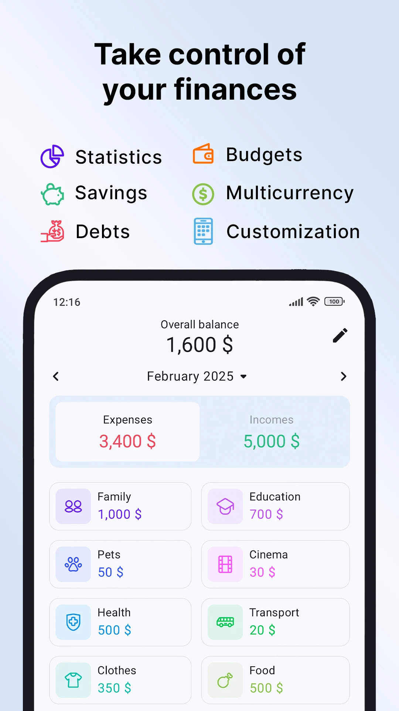
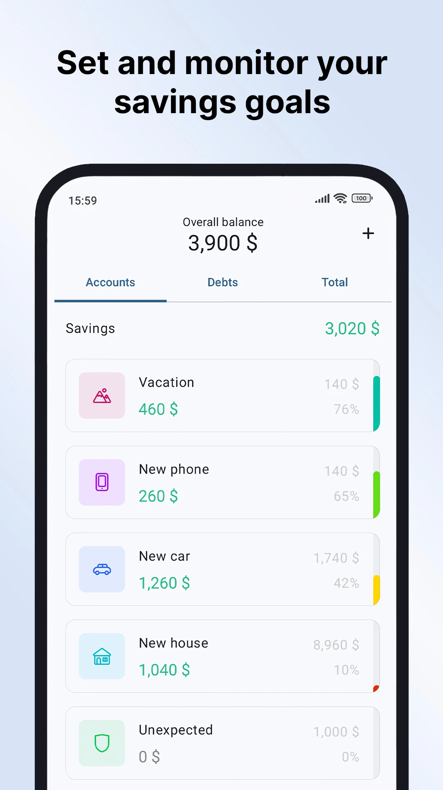

# <ins> Expenses Tracker <ins>

expenses tracker application in tkinter

### <ins> program features: <ins>

* creating/removing transactions to track money flow
* relate transaction to certain categorise (like food, clothes, salary)
* option to add transaction categorise
* option to have multiple expenses accounts (like cash, bank, savings) 
* option to see past transactions
* option to see expenses statistics like total cash flow of the month, expanses divided by categories, total expenses by day in month
* option to change expenses account currency with support for more than one type of currency
* option to see total balance of all expenses accounts
* and maybe more

### examples of simpler product:

images taken from [mony](https://play.google.com/store/apps/details?id=com.jojdevx.expense.tracker&hl=en) expenses tracking app

